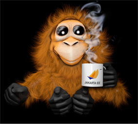
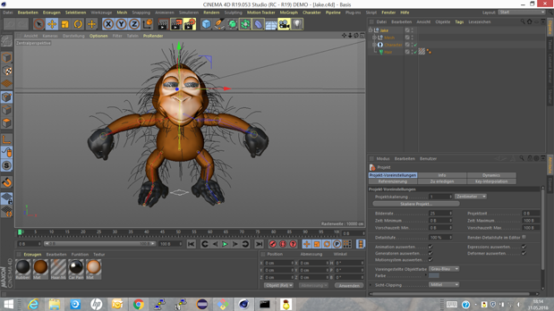

# Jake
**Jake** is a 3D Open Source Mascot inspired by Orangutan and Tarsier. It was originally created as a mascot for [Jakarta EE](https://jakarta.ee).

# Licence
**Jake** is licenced under Eclipse Public Licence 2.0 (EPL-2.0).

# Original Artwork
**Jake** was originally created by artist [Dipl.-Des. (FH) Stefanie KARG](http://www.stefanie-karg.de) of [inviticon](http://www.inviticon.eu) using MAXON Cinema 4D Studio R19. It uses hair, mesh and rig, and is know to work fine with CMotion.

# Contributions
We are happy to receive feedback and contributions from you. But as C4D is a binary file format, unfortunately we cannot accept PRs. So in case you would like to send us improvements, please contact us upfront by opening an [issue](https://github.com/inviticon/jake/issues).
